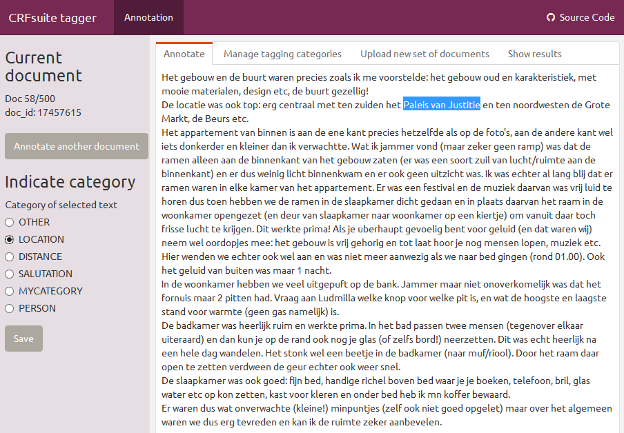

```{r setup, include=FALSE, cache=FALSE}
options(width = 1000)
knitr::opts_chunk$set(echo = TRUE, message = FALSE, comment = NA, eval = (require(udpipe, quietly = TRUE)))
```

# Model building

## CRFsuite

This R package wraps the CRFsuite C/C++ library (https://github.com/chokkan/crfsuite), allowing the following:

- Fit a **Conditional Random Field** model (1st-order linear-chain Markov) 
- Use the model to get predictions alongside the model on new data
- The focus of the implementation is in the area of Natural Language Processing where this R package allows you to easily build and apply models for **named entity recognition, text chunking, part of speech tagging, intent recognition or classification** of any category you have in mind.

For users unfamiliar with Conditional Random Field (CRF) models, you can read this excellent tutorial http://homepages.inf.ed.ac.uk/csutton/publications/crftut-fnt.pdf


## Data format

In order to build a CRF model, you need to have 

1. sequences of labels (the hidden state Y) and 
2. attributes of the observations corresponding to the labels (X). 

#### Regarding the label sequence:

Generally the labels follow the `IOB` type of scheme which look something like: B-ORG, I-ORG, B-YOUROWNLABEL, I-YOUROWNLABEL or O. Indicating the beginning of a certain category `(B-)`, the intermediate part of a certain category `(I-)` or outside the category `(O)`.

- Hence the text `I went to the New York City District on holidays` would e.g. be labelled as 
`O, O, O, O, B-LOCATION, I-LOCATION, I-LOCATION, I-LOCATION, O, O`

#### Regarding the attributes of the label observations:

The attributes of the observations are mostly something like the term itself, the neighbouring terms, the parts of speech, the neighbouring parts of speech or any specific feature you can extract and which is relevant to your business domain (e.g. the number of numbers in the token, how far is it from the start of the document or end of the document, is the token capitalised, does it contain an ampersand, ...).

#### Example data

As an example, let's get some data in Dutch for doing Named Entity Recognition which was distributed as part of the CoNLL-2002 shared task challenge. 
This dataset contains 1 row per term and provides entity labels as well as the parts of speech tag for each term. 

```{r, message = FALSE, warning=FALSE, error=FALSE, results='hide', echo=FALSE}
library(udpipe)
udmodel <- udpipe_download_model("dutch")
```

```{r, message = FALSE, warning=FALSE, error=FALSE, results='hide'}
library(crfsuite)
x <- ner_download_modeldata("conll2002-nl")
```

```{r, echo=FALSE}
knitr::opts_chunk$set(echo = TRUE, message = FALSE, comment = NA, eval = inherits(x, "data.frame") && !udmodel$download_failed)
```

```{r}
subset(x, doc_id == 100)
```

#### Attributes

As basic feature enrichment we add the parts of speech tag of the preceding and the next term which we will use later when building the model and do the same for the token. The R package data.table has a nice shift function for this.

```{r}
library(data.table)
x <- as.data.table(x)
x <- x[, pos_previous   := shift(pos, n = 1, type = "lag"), by = list(doc_id)]
x <- x[, pos_next       := shift(pos, n = 1, type = "lead"), by = list(doc_id)]
x <- x[, token_previous := shift(token, n = 1, type = "lag"), by = list(doc_id)]
x <- x[, token_next     := shift(token, n = 1, type = "lead"), by = list(doc_id)]
```

Note that CRFsuite handles all attributes equivalently, in order to distinguish between the columns, we need to prepend the column name logic to each column similar as shown at http://www.chokkan.org/software/crfsuite/tutorial.html. This is done using a custom txt_sprintf function which is similar as sprintf but handles NA values gracefully.

```{r}
x <- x[, pos_previous   := txt_sprintf("pos[w-1]=%s", pos_previous), by = list(doc_id)]
x <- x[, pos_next       := txt_sprintf("pos[w+1]=%s", pos_next), by = list(doc_id)]
x <- x[, token_previous := txt_sprintf("token[w-1]=%s", token_previous), by = list(doc_id)]
x <- x[, token_next     := txt_sprintf("token[w-1]=%s", token_next), by = list(doc_id)]
subset(x, doc_id == 100, select = c("doc_id", "token", "token_previous", "token_next"))
x <- as.data.frame(x)
```

## Model

### Train your own CRF model

Once you have data which are tagged with your own categories, you can build a CRF model. On the previous data, split it into a training and test dataset.

```{r}
crf_train <- subset(x, data == "ned.train")
crf_test <- subset(x, data == "testa")
```

And start building your model. 

- By default, the **CRF model is trained using L-BFGS with L1/L2 regularization** but other training methods are also available, namely: SGD with L2-regularization / Averaged Perceptron / Passive Aggressive or Adaptive Regularization of Weights). 
- In the below example we use the default parameters and decrease the iterations a bit to have a model ready within 30 seconds. 
- Provide the label with the categories (y) and the and the attributes of the observations (x) and indicate what is the sequence group (in this case we take document identifier).
- The model will be saved to disk in file tagger.crfsuite

```{r}
model <- crf(y = crf_train$label, 
             x = crf_train[, c("pos", "pos_previous", "pos_next", 
                               "token", "token_previous", "token_next")], 
             group = crf_train$doc_id, 
             method = "lbfgs", file = "tagger.crfsuite",
             options = list(max_iterations = 25, feature.minfreq = 5, c1 = 0, c2 = 1)) 
model
stats <- summary(model)
plot(stats$iterations$loss, pch = 20, type = "b", 
     main = "Loss evolution", xlab = "Iteration", ylab = "Loss")
```

### Use the model

You can use the model to get **predictions** of the named entity / chunks / categories you have trained. Below this is done on the holdout data. Provide the model, your data with the attributes and indicate the group the attributes belong to.

```{r}
scores <- predict(model, 
                  newdata = crf_test[, c("pos", "pos_previous", "pos_next", 
                                         "token", "token_previous", "token_next")], 
                  group = crf_test$doc_id)
crf_test$entity <- scores$label
table(crf_test$entity, crf_test$label)
```

# Create training data

In order to facilitate creating training data on your own data, with your own categories, a Shiny app is put inside this R package. To go short, this app allows you to:

- Upload an data.frame with text you want to manually label in chunks. This data.frame should contain the fields doc_id and text and should be uploaded in .rds file format.
- Indicate the categories you want to use in your model
- Start annotating by selecting the chunk of text which belongs to the categories you defined
- The annotated data is saved to disk in .rds format and can be merged with a tokenised dataset. See the example in ?merge.chunks

To start the app, make sure you have the following packages installed. 

```
install.packages("shiny")
install.packages("flexdashboard")
install.packages("DT")
install.packages("writexl")
```

And run the app with

```
rmarkdown::run(file = system.file(package = "crfsuite", "app", "annotation.Rmd"))
```

The app was developed with shiny 1.4.0.2, flexdashboard 0.5.1.1, DT 0.13, writexl 1.2 and rmarkdown 1.6 




## Improve the model

When building the model, you need to 

- **tune the parameters of the training algorithm** (L-BFGS, SBD, Averaged Perceptron, Passive/Aggressive, AROW)
- **provide good observation attributes which are specific to your domain**

### Model goodness of fit

In order to identify the parameters of the algorithm, look e.g. at 

```{r, results='hide'}
crf_options("lbfgs")
crf_options("l2sgd")
```

If you train the model with different algorithm parameters, you probably are interested to see the Precision / Recall / F1 statistics to compare them alongside the model hyperparameters. You can easily get these with the caret R package.

```
library(caret)
overview <- confusionMatrix(crf_test$entity, crf_test$label, mode = "prec_recall")
overview$overall
overview$byClass[, c("Precision", "Recall", "F1")]
```

### Example with feature engineering

To obtain better models, you need to do feature engineering specific to your business domain.

- In CRF models, the labels (y) obey the Markov property with respect to the graph conditional on the CRF attributes (x). In order to construct attributes (x) of the observations, one looks to neighbouring elements of the tokens (for example 2 words before/after the token). The following example includes features of the neighbouring tokens (namely neighbouring terms and neighbouring parts of speech tags). 
- Please visit the udpipe R package (https://CRAN.R-project.org/package=udpipe) for more information on how to extract e.g. parts of speech tags or other language features of tokens if you want get richer NLP features of the word neighbours.

This example below starts from scratch assuming that you have plain text and you annotated some chunks using the app in this package. Below the manually annotated dataset is shown.

```{r}
library(crfsuite)
library(udpipe)
library(data.table)
data(airbnb_chunks, package = "crfsuite")
str(airbnb_chunks)
```

We want to build a classifier for the following categories:

```{r}
table(airbnb_chunks$chunk_entity)
```

In order to build the training dataset, we need to have data at the token level. In the example below, this is done using the udpipe R package (https://CRAN.R-project.org/package=udpipe).

```{r, eval=FALSE}
## Annotate text data with udpipe (version >= 0.7)
udmodel <- udpipe_download_model("dutch")
udmodel <- udpipe_load_model(udmodel$file_model)
```

```{r}
airbnb_tokens <- unique(airbnb_chunks[, c("doc_id", "text")])
airbnb_tokens <- udpipe(x = airbnb_tokens, object = udmodel)
str(airbnb_tokens)
```

Once you have the data in 1 row per doc_id/token, you can enrich this with the chunk entity. Next, by using the function `crf_cbind_attributes` we enrich the training data by adding relevant attributes of words in the neighbourhood of the word. We added also a basic column indicating if the term is in the beginning or end of the sentence (bos/eos). Based on that dataset, a model can be built.

```{r}
x <- merge(airbnb_chunks, airbnb_tokens)
table(x$chunk_entity)
## Indicate beginning of sequence and end of sequence and sequence position
x <- as.data.table(x)
x <- x[, bos := sprintf("BOS+%s", (1:.N)-1), by = list(doc_id)]
x <- x[, eos := sprintf("EOS-%s", (.N:1)-1), by = list(doc_id)]
x <- as.data.frame(x)
## Add preceding and next tokens and parts of speech tags
x <- crf_cbind_attributes(x, terms = c("lemma", "upos"), 
                          by = c("doc_id", "sentence_id"), ngram_max = 3, sep = "|")

attributes <- c("bos", "eos", grep("lemma|upos", colnames(x), value=TRUE))
model <- crf(y = x$chunk_entity, x = x[, attributes], 
             group = x$doc_id, 
             method = "lbfgs") 
scores <- predict(model, newdata = x[, attributes], group = x$doc_id)
barplot(table(scores$label[scores$label != "O"]), col = "royalblue", cex.names = 0.75)
```

```{r, echo=FALSE}
invisible(if(file.exists("annotator.crfsuite")) file.remove("annotator.crfsuite"))
invisible(if(file.exists("tagger.crfsuite")) file.remove("tagger.crfsuite"))
invisible(if(file.exists(udmodel$file)) file.remove(udmodel$file))
```

Now up to you.

## Support in text mining

Need support in text mining. 
Contact BNOSAC: http://www.bnosac.be
